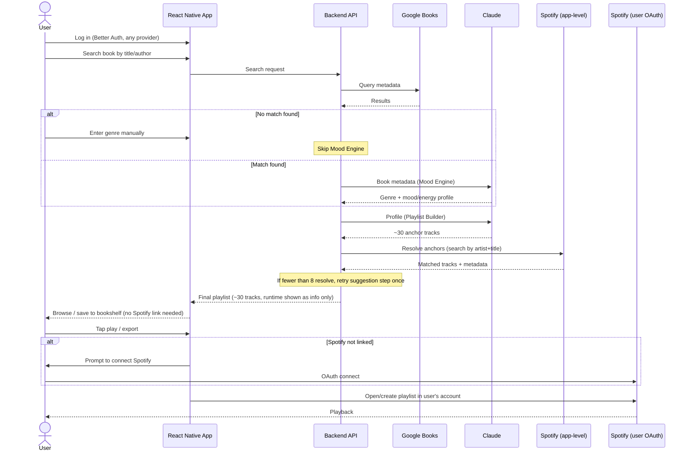

# Underscore — MVP PRD

## Problem

Stories are more involving when told with emotion and mood — the way film uses acting for emotion and music for mood. Reading has no equivalent: no soundtrack layer that matches what's happening on the page.

## Solution

Underscore is a mobile app that generates a cinematic, mood-matched playlist for the book a user is reading, using AI to infer genre and mood and Spotify to source and play real tracks.

## MVP Scope

### In scope

- **Book search**: manual search by title/author (no cover scanning in v1). If no match is found, the user can instead manually enter a genre/description (e.g. "sci-fi") to generate a genre-based ambient playlist not tied to a specific book
- **Mood/genre analysis**: one overall genre + mood/energy profile per book (no chapter-level granularity in v1)
- **Playlist generation**: LLM (Claude) suggests a fixed set of ~30 real "anchor" tracks/artists/OSTs matching the book's profile; each is resolved against the Spotify catalog (using app-level Spotify API credentials, not the user's personal login) to confirm it's real and fetch artwork/duration/artwork metadata. Generation requires no user Spotify connection at all. If fewer than 8 anchors resolve, the suggestion step is retried once before shipping a smaller-than-usual playlist.
- **Playlist duration**: not targeted or scaled to the book's length. The playlist is whatever runtime the ~30 resolved tracks add up to; total runtime is shown to the user as information only. (Spotify's Recommendation API and audio-features endpoints — which would have been needed to extend a playlist to a target runtime — were deprecated for all apps created after November 2024, which ruled out the runtime-matching approach originally considered for MVP.)
- **Playback**: playlist is played by opening/creating it in the user's connected Spotify account. Connecting Spotify is only requested at this point — when the user taps play (or otherwise tries to export/open the playlist) — not before.
- **Accounts**: Better Auth handles login (email, Google, Spotify, etc. as interchangeable providers)
- **Music connector**: a separate, pluggable layer from auth; Spotify is the first (and only, for MVP) connector. It is used for two distinct purposes with two distinct credential types:
  - **App-level** (client-credentials, no user auth): catalog search/matching during generation
  - **User-level** (per-user OAuth): playback / creating the playlist in the user's own account, requested only when they try to play
- **Bookshelf**: generated playlists are saved and tied to the user's account for later access

### Explicitly out of scope (future phases)

- Cover-scan book lookup (OCR)
- Chapter-by-chapter mood tracking / dynamic playlists
- Playlist editing (add/remove tracks)
- Sharing playlists with other users
- Additional music connectors (Apple Music, YouTube Music, Amazon Music)
- Ratings/feedback on playlists
- Playlist duration/runtime targeting scaled to book length (see Playlist duration below)

## Architecture

```
React Native app (iOS + Android)
  ├── Better Auth client (login: email, Google, Spotify, ... as providers)
  ├── Music Connector UI (prompts to link Spotify before generating/playing)
  └── Backend API (Node/TS)
        ├── Better Auth server (sessions, provider/account linking)
        ├── Book Search service        → Google Books API
        ├── Mood Engine                → Claude (genre + mood/energy analysis)
        ├── Playlist Builder           → Claude (track suggestions) + Spotify Web API (search/match, playlist creation)
        ├── Music Connector service    → stores/refreshes linked Spotify tokens (interface built to add connectors later)
        └── Data store (DB)            → users, linked accounts, books, playlists, tracks, ratings
```

**Why this shape:**
- All external API calls (Google Books, Claude, Spotify) live server-side — no API keys on-device, and providers can be swapped without an app update.
- **Auth vs. connector separation**: Better Auth governs *identity* (how a user signs in). The Music Connector service governs *capability* (which streaming account is linked for playback). A user can log in with Google and still link Spotify separately — this also means adding Apple Music/YouTube Music/Amazon Music later is a new connector, not a new auth system.
- **Generation vs. playback credentials**: the Music Connector service exposes app-level Spotify access (for catalog search during generation — no user involved) separately from user-level Spotify access (per-user OAuth, only needed for playback). This lets any logged-in user generate and browse playlists immediately; connecting Spotify is deferred to the moment it's actually needed.

## Data Flow



1. User logs in (Better Auth, any provider). No Spotify connection required yet.
2. User searches for a book by title/author → Book Search service queries Google Books API → user picks the matching result (or, if no match, manually enters a genre — see Error Handling).
3. Backend sends book metadata (title, author, description, categories) to Claude (Mood Engine) → returns a genre + mood/energy profile.
4. Backend prompts Claude (Playlist Builder) with the profile to suggest ~30 anchor tracks/artists (including an existing film/OST adaptation if one exists).
5. Backend resolves each anchor against the Spotify Web API using app-level credentials (search by artist + title) to confirm it's real and fetch artwork/duration metadata; unmatched suggestions are dropped. If fewer than 8 resolve, the suggestion step (4) is retried once.
6. Backend assembles the final ordered track list, creates/saves the playlist, and returns it to the app, with total runtime shown as information only (not a target). The user can browse it and save it to their bookshelf (default: auto-saved on generation) — all without connecting Spotify.
7. When the user taps play (or otherwise tries to open/export the playlist), the app checks for a linked personal Spotify account. If none is linked, it prompts to connect one via the Music Connector service (user-level OAuth) before proceeding.
8. Once connected, the playlist is opened/created in the user's Spotify account for playback.

## Error Handling

- **Book not found**: show "no results" state with a retry option, plus a fallback to manually enter a genre/description and generate a genre-based playlist instead (skips the Mood Engine's per-book analysis; goes straight to Playlist Builder with the user-provided genre).
- **Spotify not linked**: generation, browsing, and saving all work without a link. Only tapping play/export triggers a "connect Spotify to continue" prompt.
- **Claude suggests anchor tracks with no Spotify match** (during generation, via app-level credentials): silently drop and continue; if too few anchors resolve (e.g. < 8), regenerate suggestions once before showing a "smaller playlist than usual" notice.
- **Spotify token expired/revoked** (user-level): prompt re-linking the next time the user attempts to play/export.
- **LLM/API failures (Claude or Spotify down)**: surface a retryable error state; do not partially save a broken playlist.

## Testing

- **Unit**: mood/genre profile parsing, track-matching/resolution logic, bookshelf persistence.
- **Integration**: Book Search → Mood Engine → Playlist Builder → Spotify match pipeline, run against recorded fixtures (sample books with known expected profiles) to catch regressions in prompt or matching logic.
- **Manual/E2E**: full flow on-device — login, link Spotify, search a book, generate a playlist, play it, save to bookshelf — across a handful of genre-diverse books (e.g. literary fiction, thriller, fantasy) to sanity-check output quality, since mood-matching quality itself isn't unit-testable.

## Resolved during implementation planning

- **Hosting/DB**: Railway (managed Node + Postgres).
- **Bookshelf model**: app-only track lists stored in our DB (Spotify track IDs + metadata); nothing is created in the user's Spotify account until they press play.
- **Playlist Recommendation API dependency**: Spotify deprecated the Recommendation API and audio-features endpoints for apps created after November 2024, which is why playlist generation (above) produces a fixed ~30-track list instead of an audio-feature-seeded extension to a target runtime.
